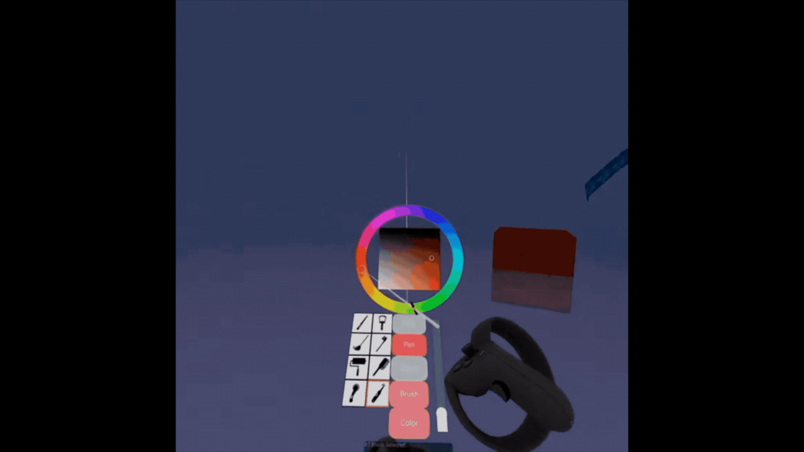
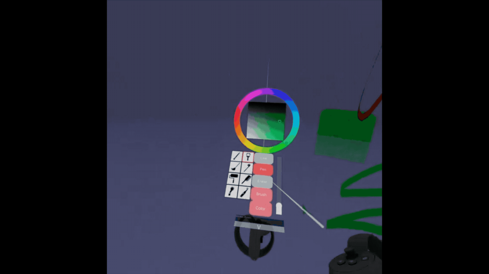

# 3DPainter
This 3D painter program for VR device. You can draw with stroke and straight line tool using controllers. A 3D UI is attached to one of the controllers where you can select color and textures as well as adjust stroke size. The project is implemented using Babylon.js and TypeScript.

# Interaction
- Press pad button(the stick button) to open/close UI menu, interact with right controller by raycasting
- Trigger button to draw line stroke(or remove strokes when eraser is selected)
- Press A/B button to undo/redo actions
- To use the line tool, press the trigger button to set the start point and preview the line , release the button to create.

# Demo
Line tool: 

Pen tool:

Eraser:

## The demo video is available [here](https://youtu.be/uIzkDZDi3vw)
